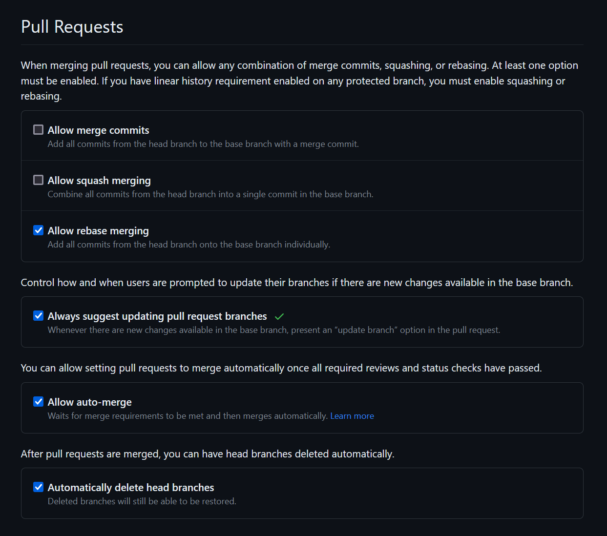
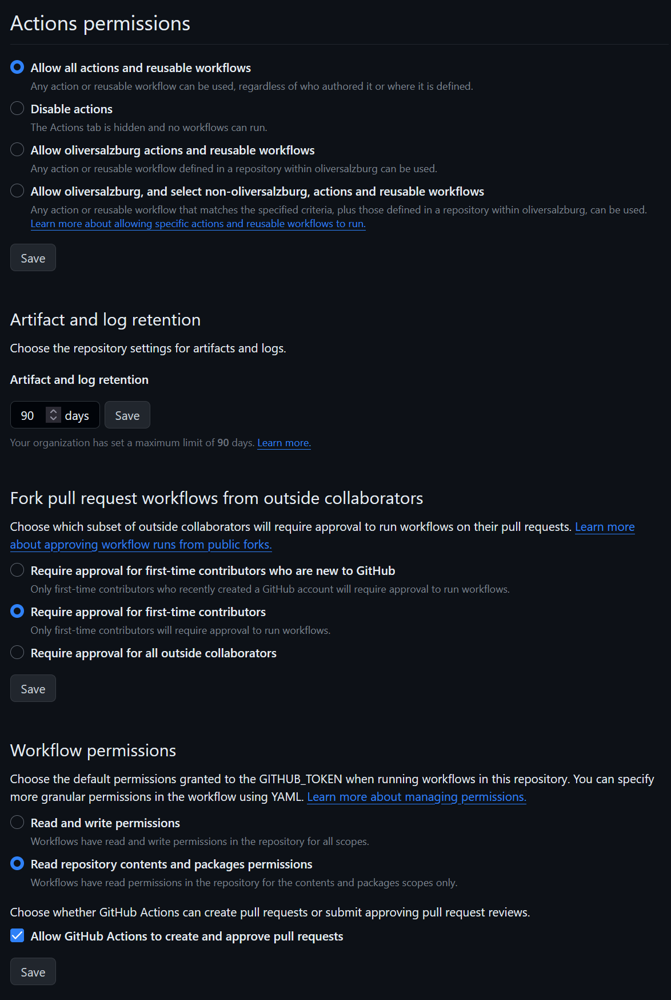

# Project Template

A monorepo built with modern Yarn.

## Does

- [Yarn](https://yarnpkg.com/)
- [Yarn Constraints](https://yarnpkg.com/features/constraints) to enforce some consistency in dependencies
- [mkdocs-material](https://squidfunk.github.io/mkdocs-material/) documentation website with [node-scripts-docs](https://oliversalzburg.github.io/node-scripts-docs/), auto-deployed to GitHub Pages
- [EditorConfig](https://editorconfig.org/) + [ESLint](https://eslint.org/) (with [@typescript-eslint](https://typescript-eslint.io/)) + [Prettier](https://prettier.io/) + [lint-staged](https://github.com/okonet/lint-staged)
- QA with [GitHub Actions](https://github.com/features/actions)
- [Renovate](https://www.mend.io/renovate/) for dependency upgrades

## GitHub Repository Configuration

Recommended setting for the new repository:

